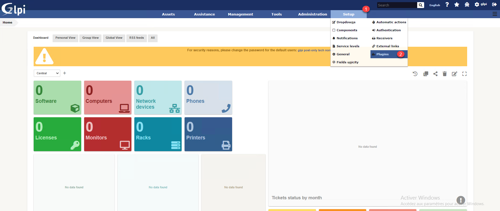

# Install

* Download latest release of plugin
* Extract in plugin directory
* Go to `Setup` > `Plugin`

* Install and enable plugin

* Go to settings of plugin and configure data to access LibreSign API

> PS: Get the X-Auth-Token DocuSeal on `User` > `Profile` > `API`

* On DocuSeal set the Webhook URL to `$GLPI-DOMAIN/plugins/docuseal/front/apirest.php` and mark form.completed

* Create a template with the fields:

`ticket_id` text
`ticket_date` date
`ticket_solution` text
`tech` text
`solution` text
`approved` checkbox
`comment` text
`date_signature` date
`signature` signature
`user` text
`email` email
